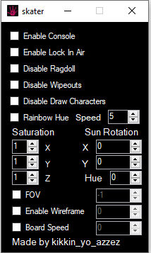
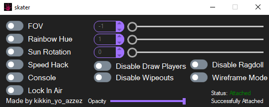
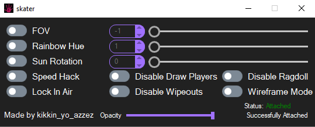

  

<h3 align="center">skater</h3>

  

    Skate.crack.exe utility tool made by kikkin_yo_azzez#4943
     
    do not use this tool in servers as it may result in a ban
  

  <h1 align="center">how to download</h1>
   
  click on the releases tab and select the version you want to download
   
  <h1 align="center">change log</h1>
   
  v1.0
   
  initial release
   

   
  v2.0
   
  updated ui and removed and added some options
   

   
  v2.1
   
  fixed speed hack and removed console option
   

   

